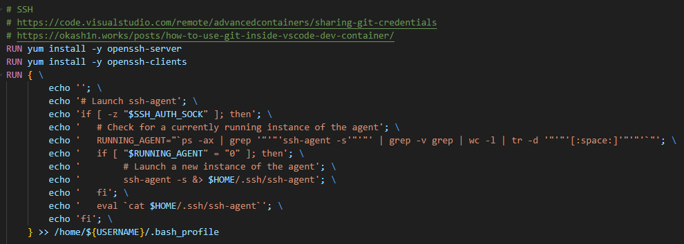

# GitHubに接続する方法についてメモ

## 概要

- SSH キーを生成（ホストマシン）
- GitHub に公開鍵を登録（ホストマシン）
- SSH キーを ssh-agent に追加（ホストマシン）
- ssh-agent がログイン時に起動されるようにする（リモートマシン）
  - Visual Studio Code の Remote Containers 拡張機能がホストの資格情報を共有してくれるので SSH の再設定は不要

参考：
https://docs.github.com/en/authentication/connecting-to-github-with-ssh/generating-a-new-ssh-key-and-adding-it-to-the-ssh-agent?platform=windows


## 新しい SSH キーの生成

```powershell
ssh-keygen -t ed25519 -C "your_email@example.com"
```

## SSH キーを ssh-agent に追加

PowerShell（管理者）で以下を実施
```powershell
# ssh-agent を起動
Get-Service -Name ssh-agent | Set-Service -StartupType Manual
Start-Service ssh-agent
```

```powershell
# 秘密キーを ssh-agent に追加
ssh-add /c/Users/YOU/.ssh/id_ed25519
```

## ssh-agent がログイン時に起動されるようにする

~/.bash_profile に以下を記述
```bash
if [ -z "$SSH_AUTH_SOCK" ]; then
   # Check for a currently running instance of the agent
   RUNNING_AGENT="`ps -ax | grep 'ssh-agent -s' | grep -v grep | wc -l | tr -d '[:space:]'`"
   if [ "$RUNNING_AGENT" = "0" ]; then
        # Launch a new instance of the agent
        ssh-agent -s &> $HOME/.ssh/ssh-agent
   fi
   eval `cat $HOME/.ssh/ssh-agent`
fi
```

上記内容を、Dockerfileに設定している
